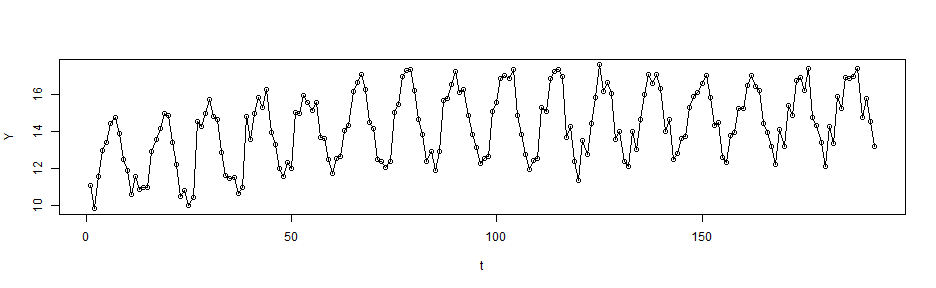
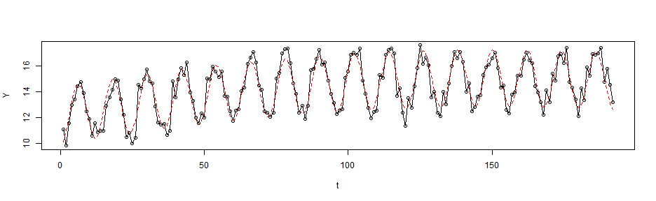
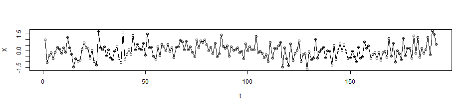
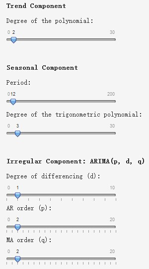
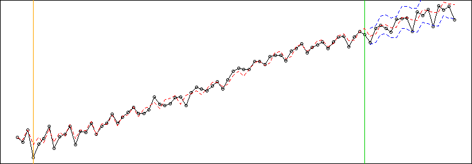

<style>
strong {
  font-weight: bold;
}
</style>

## Data
- Data are from the R package `TSA`

```r
library(TSA)
data(beersales)
Y <- as.numeric(beersales)
t <- seq_along(Y)
plot(t, Y, type = "o")
```

 

---

## Trend Component and Seasonal Component
- Trend component: polynomial $\quad t, t^2, t^3, \cdots{}$
- Seasonal component: trigonometric polynomial $\quad\sin\frac{2\pi}{T}kt, \cos\frac{2\pi}{T}kt\ (k=1,2,\cdots{})$

```r
fit <- lm(Y ~ t + I(t ^ 2) + I(sin(pi / 6 * t)) + I(cos(pi / 6 * t)))
plot(t, Y, type = "o")
points(t, fit$fitted.values, type = "l", col = "red", lty = 2)
```

 

---

## Irregular Component
- The residuals are not independent and identically distributed (i.i.d) but autocorrelated

```r
plot(t, fit$residuals, type = "o", ylab = "X")
```

 
- **A**uto**r**egressive **I**ntegrated **M**oving **A**verage model: $\text{ARIMA}(p, d, q)$
$$\left(1-\sum_{i=1}^p\phi_i\mathscr{B}^i\right)\left(1-\mathscr{B}\right)^dX_t=\left(1+\sum_{i=1}^q\theta_i\mathscr{B}^i\right)\varepsilon_t$$

---

## Parameters
<div style = "float:right"></img></div>
- Difficult to choose the parameters
 + Degree of the polynomial
 + Period of the seasonal component
 + Degree of the trigonometric polynomial
 + $p, d, q$ in the $\text{ARIMA}(p, d, q)$ model
- This application can interactively visualize the model
- Easier to find appropriate parameters

</img>
